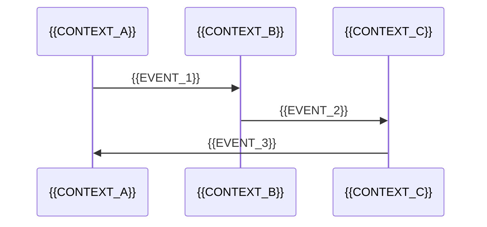

# Context Map

## 프로젝트 정보

| 항목 | 내용 |
|------|------|
| **프로젝트명** | {{PROJECT_NAME}} |
| **작성일** | {{DATE}} |
| **버전** | {{VERSION}} |

## Context 목록

### Core Domain

| Context | 설명 | 담당 팀 |
|---------|------|---------|
| {{CORE_1}} | {{CORE_DESC_1}} | {{TEAM_1}} |
| {{CORE_2}} | {{CORE_DESC_2}} | {{TEAM_2}} |

### Supporting Subdomain

| Context | 설명 | 담당 팀 |
|---------|------|---------|
| {{SUPPORT_1}} | {{SUPPORT_DESC_1}} | {{TEAM_3}} |

### Generic Subdomain

| Context | 설명 | 담당 팀/서비스 |
|---------|------|---------------|
| {{GENERIC_1}} | {{GENERIC_DESC_1}} | {{TEAM_4}} |

## Context Map 다이어그램

```mermaid
graph TB
    subgraph Core Domain
        {{CORE_1}}[{{CORE_1}}]
        {{CORE_2}}[{{CORE_2}}]
    end

    subgraph Supporting
        {{SUPPORT_1}}[{{SUPPORT_1}}]
    end

    subgraph Generic
        {{GENERIC_1}}[{{GENERIC_1}}]
    end

    {{GENERIC_1}} -->|OHS/PL| {{CORE_1}}
    {{CORE_1}} -->|ACL| {{CORE_2}}
    {{CORE_1}} -->|PL| {{SUPPORT_1}}
```

## 관계 상세

### {{RELATION_1}}: {{UPSTREAM_1}} → {{DOWNSTREAM_1}}

| 항목 | 내용 |
|------|------|
| **패턴** | {{PATTERN_1}} |
| **통신 방식** | REST API / Event / gRPC |
| **데이터 흐름** | {{DATA_FLOW_1}} |

**상세 설명**:
{{RELATION_DETAIL_1}}

**통합 포인트**:
- {{INTEGRATION_POINT_1}}

---

### {{RELATION_2}}: {{UPSTREAM_2}} → {{DOWNSTREAM_2}}

| 항목 | 내용 |
|------|------|
| **패턴** | {{PATTERN_2}} |
| **통신 방식** | REST API / Event / gRPC |
| **데이터 흐름** | {{DATA_FLOW_2}} |

**상세 설명**:
{{RELATION_DETAIL_2}}

## 통합 패턴 요약

| Upstream | Downstream | 패턴 | 통신 |
|----------|------------|------|------|
| {{UP_1}} | {{DOWN_1}} | {{PAT_1}} | {{COMM_1}} |
| {{UP_2}} | {{DOWN_2}} | {{PAT_2}} | {{COMM_2}} |
| {{UP_3}} | {{DOWN_3}} | {{PAT_3}} | {{COMM_3}} |

## 이벤트 흐름



## Anti-Corruption Layer 상세

### {{ACL_NAME}}

**위치**: {{DOWNSTREAM_CONTEXT}}

**변환 대상**:
| External Model | Domain Model |
|---------------|--------------|
| {{EXT_1}} | {{DOM_1}} |
| {{EXT_2}} | {{DOM_2}} |

**구현 예시**:
```kotlin
class {{ACL_NAME}}Translator {
    fun translate(external: {{EXT_TYPE}}): {{DOM_TYPE}} {
        // 변환 로직
    }
}
```

## 변경 이력

| 버전 | 날짜 | 변경 내용 |
|------|------|----------|
| 1.0.0 | {{DATE}} | 최초 작성 |
