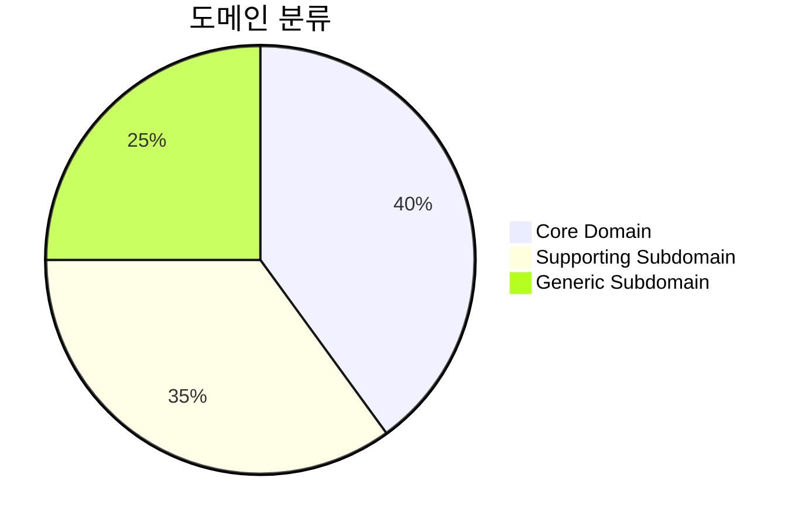
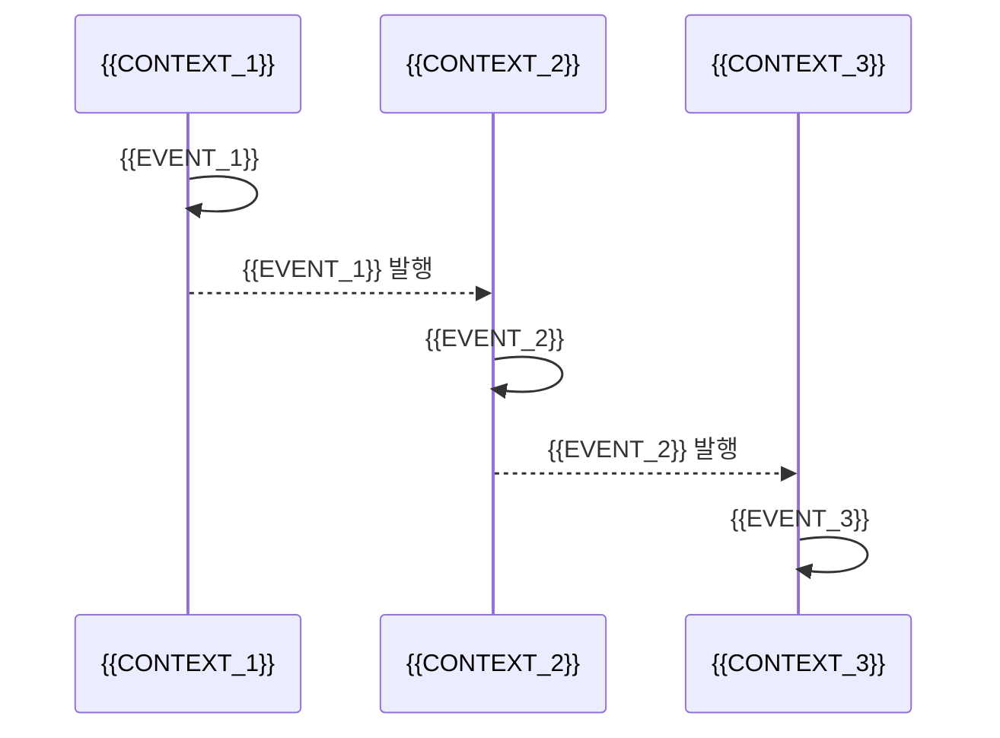

# 도메인 모델 문서

## 프로젝트 정보

| 항목 | 내용 |
|------|------|
| **프로젝트** | {{PROJECT_NAME}} |
| **작성일** | {{DATE}} |
| **버전** | {{VERSION}} |

---

## 1. 도메인 개요

### 비즈니스 목표

{{BUSINESS_GOAL}}

### 핵심 기능

1. {{FEATURE_1}}
2. {{FEATURE_2}}
3. {{FEATURE_3}}

---

## 2. 도메인 분류



### Core Domain

| 도메인 | 설명 | 우선순위 |
|--------|------|---------|
| {{CORE_1}} | {{CORE_DESC_1}} | 🔴 높음 |
| {{CORE_2}} | {{CORE_DESC_2}} | 🔴 높음 |

### Supporting Subdomain

| 도메인 | 설명 | 우선순위 |
|--------|------|---------|
| {{SUPPORT_1}} | {{SUPPORT_DESC_1}} | 🟡 중간 |

### Generic Subdomain

| 도메인 | 설명 | 전략 |
|--------|------|------|
| {{GENERIC_1}} | {{GENERIC_DESC_1}} | 외부 서비스 / 자체 구현 |

---

## 3. Bounded Context

### Context Map

```mermaid
graph TB
    subgraph Core
        C1[{{CONTEXT_1}}]
        C2[{{CONTEXT_2}}]
    end

    subgraph Supporting
        S1[{{CONTEXT_3}}]
    end

    subgraph Generic
        G1[{{CONTEXT_4}}]
    end

    G1 -->|OHS| C1
    C1 -->|ACL| C2
    C1 -->|PL| S1
    C2 -->|PL| S1
```

### Context 상세

| Context | 분류 | 핵심 책임 | Aggregates |
|---------|------|----------|------------|
| {{CONTEXT_1}} | Core | {{RESP_1}} | {{AGGS_1}} |
| {{CONTEXT_2}} | Core | {{RESP_2}} | {{AGGS_2}} |
| {{CONTEXT_3}} | Supporting | {{RESP_3}} | {{AGGS_3}} |
| {{CONTEXT_4}} | Generic | {{RESP_4}} | {{AGGS_4}} |

---

## 4. Aggregate 모델

### {{CONTEXT_1}} Context

```mermaid
classDiagram
    class {{AGGREGATE_1}} {
        +{{AGG_1_ID}} id
        +{{PROP_1}}
        +{{PROP_2}}
        +{{METHOD_1}}()
        +{{METHOD_2}}()
    }

    class {{VALUE_OBJECT_1}} {
        +{{VO_PROP_1}}
        +{{VO_PROP_2}}
    }

    {{AGGREGATE_1}} *-- {{VALUE_OBJECT_1}}
```

| Aggregate | Root Entity | 핵심 행위 | Domain Events |
|-----------|-------------|----------|---------------|
| {{AGGREGATE_1}} | {{ROOT_1}} | {{BEHAVIOR_1}} | {{EVENTS_1}} |
| {{AGGREGATE_2}} | {{ROOT_2}} | {{BEHAVIOR_2}} | {{EVENTS_2}} |

---

## 5. Domain Events

### 이벤트 흐름



### 이벤트 목록

| 이벤트 | Context | Aggregate | 구독자 | 용도 |
|--------|---------|-----------|--------|------|
| {{EVENT_1}} | {{CTX_1}} | {{AGG_1}} | {{SUB_1}} | {{PURPOSE_1}} |
| {{EVENT_2}} | {{CTX_2}} | {{AGG_2}} | {{SUB_2}} | {{PURPOSE_2}} |
| {{EVENT_3}} | {{CTX_3}} | {{AGG_3}} | {{SUB_3}} | {{PURPOSE_3}} |

---

## 6. Ubiquitous Language 요약

### {{CONTEXT_1}}

| 용어 | 영문 | 정의 |
|------|------|------|
| {{TERM_1}} | {{EN_1}} | {{DEF_1}} |
| {{TERM_2}} | {{EN_2}} | {{DEF_2}} |

### {{CONTEXT_2}}

| 용어 | 영문 | 정의 |
|------|------|------|
| {{TERM_3}} | {{EN_3}} | {{DEF_3}} |
| {{TERM_4}} | {{EN_4}} | {{DEF_4}} |

---

## 7. 통합 패턴

| Upstream | Downstream | 패턴 | 통신 방식 |
|----------|------------|------|----------|
| {{UP_1}} | {{DOWN_1}} | {{PATTERN_1}} | {{COMM_1}} |
| {{UP_2}} | {{DOWN_2}} | {{PATTERN_2}} | {{COMM_2}} |

---

## 8. 기술 매핑

| Bounded Context | 서비스 | 데이터베이스 | 메시징 |
|-----------------|--------|-------------|--------|
| {{CONTEXT_1}} | {{SVC_1}} | {{DB_1}} | {{MSG_1}} |
| {{CONTEXT_2}} | {{SVC_2}} | {{DB_2}} | {{MSG_2}} |

---

## 9. 관련 문서

- [Bounded Context 정의서](./bounded-context/)
- [Aggregate 설계서](./aggregate-design/)
- [Context Map](./context-map.md)
- [Ubiquitous Language 용어집](./ubiquitous-language-glossary.md)
- [Event Storming 결과](./event-storming-result.md)

---

## 변경 이력

| 버전 | 날짜 | 변경 내용 |
|------|------|----------|
| 1.0.0 | {{DATE}} | 최초 작성 |
