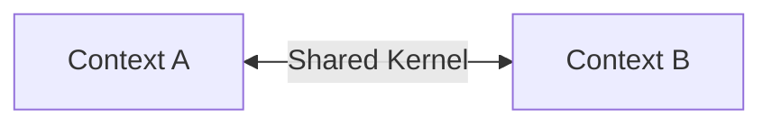
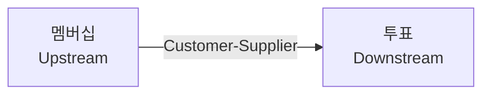
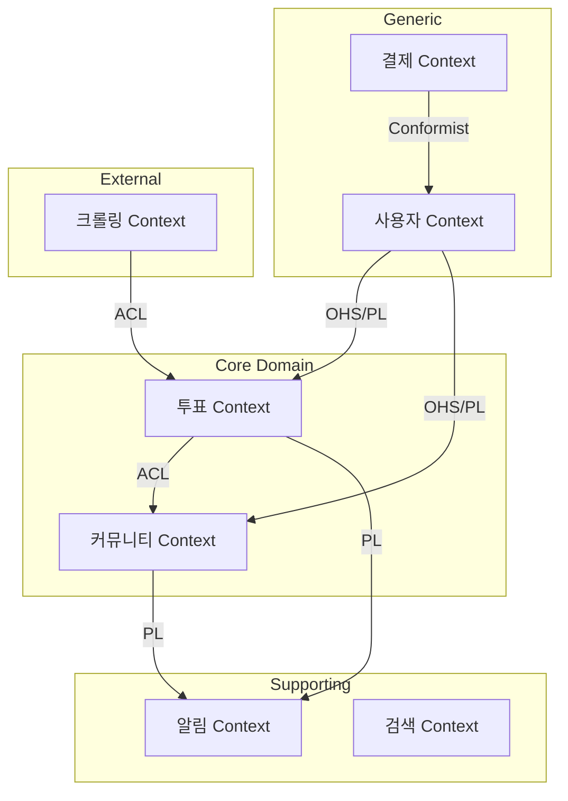

# Context Mapping Patterns

## Overview

Context Mapping은 Bounded Context 간의 관계와 통합 방법을 정의합니다.

## Patterns

### 1. Shared Kernel (공유 커널)

두 Context가 코드/모델의 일부를 공유합니다.

**사용 시기**: 밀접하게 협력하는 팀
**주의**: 변경 시 양쪽 팀 합의 필요



### 2. Customer-Supplier (고객-공급자)

Upstream(공급자)이 Downstream(고객)의 요구사항을 수용합니다.

**사용 시기**: 공급자가 고객의 요구를 우선시할 때
**FanPulse 예시**: 멤버십(공급자) → 투표(고객) - VIP 투표권 제공



### 3. Conformist (순응자)

Downstream이 Upstream의 모델을 그대로 따릅니다.

**사용 시기**: Upstream이 Downstream의 요구를 고려하지 않을 때
**예시**: 외부 결제 API 사용 시

### 4. Anti-Corruption Layer (부패 방지 계층)

Downstream이 Upstream의 모델을 자신의 모델로 변환합니다.

**사용 시기**:
- 레거시 시스템 연동
- 외부 API 의존성 격리
- 모델 오염 방지

**FanPulse 예시**: 크롤링 데이터를 도메인 모델로 변환

```kotlin
// ACL 예시
class ChartDataTranslator {
    fun translate(crawledData: CrawledChartData): ChartRanking {
        return ChartRanking(
            rank = crawledData.rank,
            artist = Artist.of(crawledData.artistName),
            song = Song.of(crawledData.songTitle),
            source = ChartSource.fromString(crawledData.source)
        )
    }
}
```

### 5. Open Host Service (개방 호스트 서비스)

Upstream이 표준화된 API를 제공합니다.

**사용 시기**: 여러 Downstream이 사용하는 서비스
**FanPulse 예시**: 사용자 Context가 REST API 제공

### 6. Published Language (공개 언어)

Context 간 통신을 위한 공통 언어(JSON Schema, Protobuf 등)를 정의합니다.

**사용 시기**: Open Host Service와 함께 사용

```kotlin
// Published Language - Domain Event JSON Schema
data class VoteCastedEvent(
    val eventType: String = "vote.casted",
    val aggregateId: String,
    val userId: String,
    val artistId: String,
    val timestamp: String
)
```

### 7. Separate Ways (독립 경로)

통합 없이 각 Context가 독립적으로 운영됩니다.

**사용 시기**: 통합 비용 > 통합 가치

### 8. Partnership (파트너십)

두 팀이 동등하게 협력하여 통합합니다.

**사용 시기**: 두 Context가 함께 성공/실패해야 할 때

## Context Map 작성 예시



## 패턴 선택 가이드

| 상황 | 권장 패턴 |
|------|----------|
| 같은 팀, 밀접한 협력 | Shared Kernel, Partnership |
| Upstream이 협조적 | Customer-Supplier |
| Upstream이 비협조적 | Conformist, ACL |
| 레거시/외부 시스템 | ACL |
| 여러 Consumer 대응 | OHS + Published Language |
| 통합 가치 낮음 | Separate Ways |
