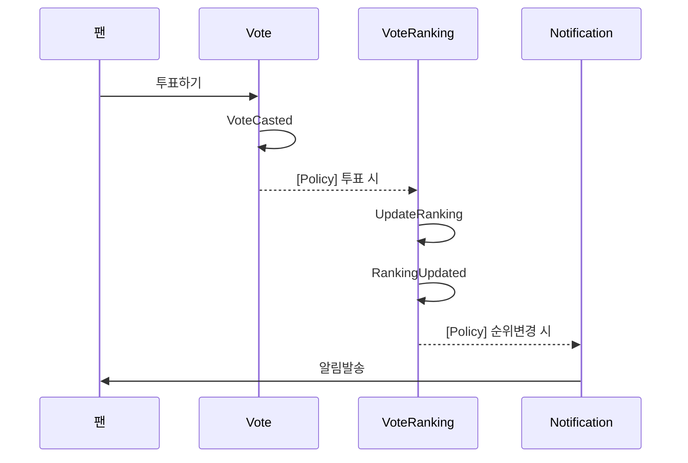

# Event Storming

## Overview

Event Storming은 도메인 전문가와 개발자가 함께 비즈니스 프로세스를 시각적으로 탐색하는 워크숍 기법입니다.

## 기본 요소

### 색상 코드

| 색상 | 요소 | 설명 |
|------|------|------|
| 🟧 주황색 | Domain Event | 과거에 발생한 중요 사건 |
| 🟦 파란색 | Command | 이벤트를 발생시키는 행위 |
| 🟨 노란색 | Aggregate | 커맨드를 처리하는 주체 |
| 🟪 보라색 | Policy | 이벤트 → 커맨드 연결 (When-Then) |
| 🟩 녹색 | Read Model | 사용자에게 보여지는 정보 |
| 🟥 빨간색 | Hot Spot | 논쟁점, 질문, 불확실한 부분 |
| 👤 작은 노란색 | Actor | 커맨드를 수행하는 사용자/시스템 |
| 📋 흰색 | External System | 외부 시스템 |

## 프로세스

### 1단계: Domain Event 도출 (Chaotic Exploration)

모든 참가자가 도메인에서 발생하는 이벤트를 자유롭게 작성합니다.

**규칙**:
- 과거형으로 작성 ("투표됨", "회원가입됨")
- 비즈니스 관점에서 중요한 사건만
- 순서 상관없이 자유롭게

**FanPulse 예시**:
```
🟧 회원가입됨        🟧 투표됨           🟧 게시글작성됨
🟧 로그인됨          🟧 투표종료됨       🟧 댓글작성됨
🟧 VIP가입됨         🟧 순위변경됨       🟧 좋아요됨
🟧 포인트적립됨      🟧 콘서트예매됨     🟧 신고됨
```

### 2단계: 타임라인 정렬

이벤트를 시간 순서대로 정렬합니다.

```
[시작] → 회원가입됨 → 로그인됨 → VIP가입됨 → 투표됨 → 순위변경됨 → [종료]
```

### 3단계: Command 추가

각 이벤트를 발생시키는 커맨드를 추가합니다.

```
🟦 회원가입 → 🟧 회원가입됨
🟦 투표하기 → 🟧 투표됨
🟦 게시글작성 → 🟧 게시글작성됨
```

### 4단계: Aggregate 식별

커맨드를 처리하는 Aggregate를 식별합니다.

```
       🟦 투표하기
           ↓
       🟨 Vote
           ↓
       🟧 투표됨
```

### 5단계: Policy 추가

이벤트와 커맨드를 연결하는 자동화 규칙을 추가합니다.

```
🟧 투표됨 → 🟪 투표 시 → 🟦 랭킹업데이트 → 🟧 순위변경됨
🟧 VIP가입됨 → 🟪 VIP가입 시 → 🟦 추가투표권부여 → 🟧 투표권부여됨
```

### 6단계: Bounded Context 도출

관련된 Aggregate를 그룹핑하여 Bounded Context를 식별합니다.

```
┌─────────────────────────┐    ┌─────────────────────────┐
│     투표 Context        │    │   커뮤니티 Context       │
│                         │    │                         │
│  🟨 Vote                │    │  🟨 Post                │
│  🟨 VoteSession         │    │  🟨 Comment             │
│  🟨 VoteRanking         │    │  🟨 Like                │
└─────────────────────────┘    └─────────────────────────┘
```

## Event Storming 결과물

### 1. Domain Event 목록

```markdown
| 이벤트 | 설명 | Aggregate | Context |
|--------|------|-----------|---------|
| VoteCasted | 사용자가 투표함 | Vote | 투표 |
| VoteSessionEnded | 투표 세션 종료 | VoteSession | 투표 |
| RankingUpdated | 순위 갱신됨 | VoteRanking | 투표 |
```

### 2. Command-Event Flow

```markdown
| Actor | Command | Aggregate | Event |
|-------|---------|-----------|-------|
| 팬 | 투표하기 | Vote | VoteCasted |
| 시스템 | 투표종료 | VoteSession | VoteSessionEnded |
| 시스템 | 랭킹갱신 | VoteRanking | RankingUpdated |
```

### 3. Policy 목록

```markdown
| Policy | Trigger Event | Command | Target Aggregate |
|--------|---------------|---------|------------------|
| 투표 시 랭킹 갱신 | VoteCasted | UpdateRanking | VoteRanking |
| VIP 가입 시 투표권 부여 | VIPSubscribed | GrantVoteTicket | VoteTicket |
```

## Mermaid 다이어그램 예시



## Tips

- 🟥 Hot Spot은 나중에 해결할 논쟁점으로 표시
- 외부 시스템 연동은 📋 External System으로 표시
- 너무 상세한 기술적 이벤트는 제외
- 비즈니스 관점의 이벤트에 집중
