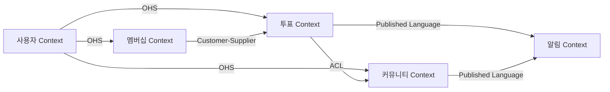

# Strategic Design (전략적 설계)

## Overview

Strategic Design은 비즈니스 도메인을 이해하고 시스템을 큰 단위로 분할하는 DDD의 상위 레벨 설계입니다.

## Bounded Context

### 정의

Bounded Context는 특정 도메인 모델이 유효한 경계입니다. 각 Bounded Context 내에서 Ubiquitous Language가 일관되게 사용됩니다.

### 식별 방법

1. **비즈니스 능력 기반**: 각 비즈니스 기능별로 분리
2. **팀 구조 기반**: 팀의 책임 영역별로 분리
3. **데이터 응집도 기반**: 함께 변경되는 데이터를 그룹핑
4. **용어 불일치 기반**: 같은 용어가 다른 의미로 사용되는 경계

### 예시 (FanPulse)

**투표 Context**: Vote, Voting, VoteResult, Ranking
**커뮤니티 Context**: Post, Comment, Like, Feed
**멤버십 Context**: Membership, Subscription, VIPBenefit

### Bounded Context 정의 시 고려사항

- 각 Context는 독립적으로 배포 가능해야 함
- Context 간 의존성은 최소화
- Context 내부는 높은 응집도 유지
- 명확한 인터페이스로 다른 Context와 통신

## Domain Classification

### Core Domain (핵심 도메인)

비즈니스 경쟁력의 핵심이 되는 도메인. 가장 많은 투자와 관심이 필요합니다.

**특징**:
- 비즈니스 차별화 요소
- 복잡한 비즈니스 로직
- 자주 변경됨
- 전문가의 깊은 지식 필요

**FanPulse 예시**: 투표 시스템, 팬 커뮤니티

### Supporting Subdomain (지원 서브도메인)

Core Domain을 지원하지만, 비즈니스 차별화 요소는 아닙니다.

**특징**:
- Core Domain을 돕는 역할
- 어느 정도 복잡성 존재
- 기성 솔루션 활용 가능

**FanPulse 예시**: 알림 시스템, 검색 기능

### Generic Subdomain (일반 서브도메인)

비즈니스 특화 로직이 없는 일반적인 도메인. 외부 솔루션 구매를 고려합니다.

**특징**:
- 비즈니스 특화 로직 없음
- 범용적인 기능
- 외부 라이브러리/서비스 사용 권장

**FanPulse 예시**: 사용자 인증, 결제 처리, 이메일 발송

### 도메인 분류 프로세스

1. 모든 비즈니스 기능 나열
2. 각 기능의 복잡도 평가
3. 비즈니스 가치 평가 (차별화 요소인가?)
4. Core / Supporting / Generic 분류
5. 우선순위 결정 (Core → Supporting → Generic)

## Context Mapping

### 정의

Bounded Context 간의 관계와 통합 방법을 정의하는 것입니다.

### Context Mapping 패턴

자세한 패턴은 `context-mapping-patterns.md` 참고.

주요 패턴:
- **Shared Kernel**: 공유 모델
- **Customer-Supplier**: 고객-공급자 관계
- **Conformist**: 순응자
- **Anti-Corruption Layer (ACL)**: 부패 방지 계층
- **Open Host Service**: 개방 호스트 서비스
- **Published Language**: 공개 언어
- **Separate Ways**: 독립 경로
- **Partnership**: 파트너십

### Context Map 작성 순서

1. 모든 Bounded Context 나열
2. Context 간 관계 식별
3. 데이터 흐름 방향 결정
4. 적절한 통합 패턴 선택
5. Mermaid 다이어그램으로 시각화

### Context Map 예시

## Ubiquitous Language (공통 언어)

### 정의

도메인 전문가와 개발자가 공유하는 공통의 언어. 코드, 문서, 대화에서 일관되게 사용됩니다.

### 작성 가이드

자세한 가이드는 `ubiquitous-language.md` 참고.

### 원칙

1. **도메인 전문가의 용어 우선**: 개발 용어가 아닌 비즈니스 용어 사용
2. **명확성**: 모호한 표현 금지
3. **일관성**: Bounded Context 내에서 동일 용어는 동일 의미
4. **진화**: 도메인 이해도가 높아지면 용어도 개선

### 예시 (투표 Context)

| 용어 | 정의 | 영문 |
|------|------|------|
| 투표 | 팬들이 아티스트나 콘텐츠에 대해 선택권을 행사하는 행위 | Vote |
| 투표 항목 | 투표 대상이 되는 개별 선택지 | VoteOption |
| 투표 결과 | 투표 종료 후 집계된 최종 결과 | VoteResult |
| 투표 자격 | 투표에 참여할 수 있는 조건 | VoteEligibility |
| 중복 투표 방지 | 동일 사용자의 반복 투표를 제한하는 정책 | DuplicateVotePrevention |

## Strategic Design 워크플로우

### 1단계: 도메인 이해

- 비즈니스 요구사항 분석
- 도메인 전문가 인터뷰
- 기존 문서 (화면정의서, DB정의서) 검토

### 2단계: Bounded Context 식별

- 비즈니스 기능별 그룹핑
- Context 경계 정의
- Ubiquitous Language 초안 작성

### 3단계: 도메인 분류

- Core / Supporting / Generic 분류
- 우선순위 결정
- 투자 전략 수립

### 4단계: Context Mapping

- Context 간 관계 정의
- 통합 패턴 선택
- Context Map 다이어그램 작성

### 5단계: 문서화

- Bounded Context 정의서 작성
- Ubiquitous Language 용어집 작성
- Context Map 문서화

## Best Practices

### DO

- ✅ 비즈니스 요구사항을 먼저 이해하고 기술 설계는 나중에
- ✅ 도메인 전문가와 지속적인 대화
- ✅ Bounded Context는 팀의 인지 부하를 고려하여 적절한 크기로
- ✅ Context Map은 지속적으로 업데이트
- ✅ Ubiquitous Language는 코드에 그대로 반영

### DON'T

- ❌ 기술 계층(Controller, Service, Repository)을 Bounded Context로 착각
- ❌ 너무 작은 단위로 Context 분리 (Microservices ≠ Bounded Context)
- ❌ Context 간 직접적인 데이터베이스 공유
- ❌ 모호한 용어 사용 (예: "처리", "관리", "데이터")
- ❌ 개발자 편의를 위해 비즈니스 용어 변경

## References

- Eric Evans, "Domain-Driven Design" (2003)
- Vaughn Vernon, "Implementing Domain-Driven Design" (2013)
- Martin Fowler, "BoundedContext" (https://martinfowler.com/bliki/BoundedContext.html)
